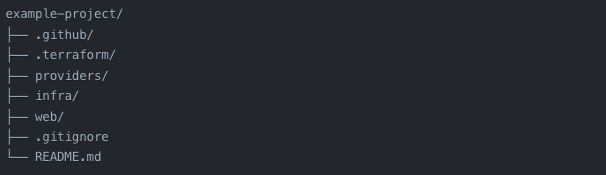

Deploying Your Website with Terraform and GitHub Actions CI/CD Pipeline
=======================================================================

This repository contains the necessary code and configuration files to deploy your website using Terraform and set up a CI/CD pipeline with GitHub Actions. The CI/CD pipeline will automatically deploy your HTML/CSS files whenever changes are pushed to the main branch.

Table of Contents
-----------------

*   Introduction

*   Prerequisites

*   Getting Started

*   Folder Structure
    
*   Terraform Configuration
    
*   GitHub Actions Workflow
    
*   Deployment
    
*   Contributing
    
*   License
    

Introduction
------------

Deploying a website can be a complex and time-consuming process. However, by leveraging the power of infrastructure as code and automated deployment processes, we can streamline the deployment of your website and ensure a smooth and efficient workflow.

This repository provides a step-by-step guide on how to deploy your website using Terraform and set up a CI/CD pipeline with GitHub Actions. The CI/CD pipeline will automatically deploy your HTML/CSS files whenever changes are pushed to the main branch.

Prerequisites
-------------

Before getting started, ensure that you have the following prerequisites:

*   An Azure account with the necessary permissions to create and manage resources
    
*   Terraform installed on your local machine
    
*   A GitHub account and repository to store your code and configuration files
    

Getting Started
---------------

To get started with deploying your website using Terraform and GitHub Actions, follow these steps:

1.  Clone this repository to your local machine.
    
2.  Update the Terraform configuration files with your desired settings and resource names.
    
3.  Set up the necessary Azure resources and permissions.
    
4.  Configure the GitHub Actions workflow to match your repository and deployment requirements.
    
5.  Push your changes to the main branch to trigger the CI/CD pipeline.
    

Folder Structure
----------------

The repository has the following folder structure:



- The `.github/workflows` directory contains the GitHub Actions workflow file `terraform.yml`.
- The `web` directory contains your website files, including HTML, CSS, and other assets.
- The `main.tf` file contains the main Terraform configuration.
- The `variables.tf` file defines the input variables used in the Terraform configuration.

    

Terraform Configuration
-----------------------

The Terraform configuration files define the infrastructure resources required to deploy your website. The main configuration file main.tf specifies the Azure provider, creates an Azure App Service Plan, and deploys your website as an Azure Web App.

Make sure to update the configuration files with your desired settings, such as resource names, locations, and SKUs.

GitHub Actions Workflow
-----------------------

The GitHub Actions workflow file terraform.yml defines the CI/CD pipeline for deploying your website. The workflow is triggered whenever changes are pushed to the main branch.

The workflow includes the following steps:

1.  Checkout the repository code.
    
2.  Set up Terraform.
    
3.  Initialize the Terraform working directory.
    
4.  Apply the Terraform configuration to deploy the website.
    

Make sure to configure the necessary secrets in your GitHub repository settings, such as Azure credentials and subscription details.

Deployment
----------

Whenever changes are pushed to the main branch, the GitHub Actions workflow will automatically trigger and deploy your website. The workflow will provision the necessary Azure resources and deploy your HTML/CSS files to the Azure Web App.

You can monitor the deployment progress in the GitHub Actions tab of your repository.

License
-------

This repository is licensed under the [MIT License]


Architecture Diagram 
-------

This is an Architecture Diagram that represents the flow and structure of the code base.

<!-- Use the following code fence with the language set to 'mermaid' -->
```mermaid
graph TB
subgraph Azure Subscription
    subgraph Resource Group
        AppServicePlan(App Service Plan)
        AppService(App Service)
        DNSZone(DNS Zone)
        ARecord(A Record)
        TXTRecord(TXT Record)
    end
    subgraph Azure Active Directory
        AzureADApplication(Azure AD Application)
        ServicePrincipal(Service Principal)
    end
    subgraph GitHub
        GitHubRepository(GitHub Repository)
        GitHubActions(GitHub Actions)
        GitHubSecrets(GitHub Secrets)
    end
 
    Terraform(Terraform)
end
 
subgraph Developer Machine
    LocalTerraformConfig(Local Terraform Configuration)
end
 
GitHubRepository --> |Push to main branch| GitHubActions
GitHubActions --> |Triggers| Terraform
Terraform --> |Authenticates| AzureADApplication
Terraform --> |Provisions| AppServicePlan
Terraform --> |Provisions| AppService
Terraform --> |Provisions| DNSZone
DNSZone --> ARecord
DNSZone --> TXTRecord
AppService --> |Binds| CustomDomain(Custom Domain)
AppService --> |Enables| SSLCertificate(SSL Certificate)
GitHubSecrets --> |Provides secrets| GitHubActions
LocalTerraformConfig --> |Configures| Terraform
